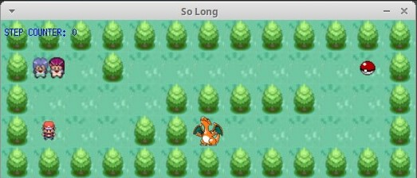

<h1 align="center"> 🕹 <a href="#"> SoLong </a></h1>
<h3 align="center">My newest project as a cadet at École 42. This is my own 
2D game.</h3>
<h4 align="center">
	<b>Status</b>: Finished ✅🚀 (120%)
</h4>
<p align="center">
	<a href="#About">About</a> •
	<a href="#How-it-works">How it works</a> • 
	<a href="#Gameplay">Gameplay</a> •
	<a href="#Author">Author</a>
</p>

## 💻 About <a name='About'></a>

🕹 The goal of this project was to build a very small 2D game. It was made to make us work with textures, sprites. And some very basic gameplay elements.

### 🎯 Briefing

Mandatory Part
* The management of your window must remain smooth `changing to another window, minimizing`, etc;
* At every move the current number of movements must be displayed in the shell;
* The player must be able to move: up, down, left, right;
* You will use a 2D view (top-down or profile);
* The `W, A, S, and D` keys will be used to move the main character;
* Pressing `ESC` must close the window and quit the program cleanly;
* Clicking on the `red cross` on the window’s frame must close the window and
quit the program cleanly;
* Your program must take as a first argument a map description file with the `.ber`
extension;
* The map must be composed of only 5 possible characters: 0 for an empty
space, 1 for a wall, C for a collectible, E for map exit and P for the player’s
starting position;
* Map must have at least one exit, one collectible, and one starting position;
* The map must be `closed/surrounded by walls`, if not the program must return
an error;
* The map must be rectangular;
* You don’t need to check if there’s a valid path in the map;
* If any misconfiguration of any kind is encountered in the file, the program
must exit properly and return "Error\n" followed by an explicit error message
of your choice.

Bonus Part			
* Enemy patrols that cause the player to lose in case of contact; 
* There’s some sprite animation;
* Movement count is directly displayed on the screen instead of shell output.

---

## 🚀 How it works <a name='How-it-works'></a>

### Clone this repository
```git
git clone git@github.com:prmarquesz/so_long.git
```
### Running Makefile
Go to the directory where you cloned and run the command
```Makefile
make
```
### Available Options
Command | Usage
------- | -----
`make` | Creates the executable (equivalent to `make all` and `make so_long`)
`make clean` | Removes the object files
`make fclean` | Removes the object files and the library (libft.a and libmlx.a)
`make re` | Invokes `fclean` rule and then `all`

---

## 🎮 Gameplay <a name='Gameplay'></a>

### Running the program
Choose a map to play, or create your own map (provided map settings are respected).
And then have fun
```c
./so_long map_files/map3.ber
```


---

# 👨‍🚀 Author <a name='Author'></a>

<a href="#">
 
 <br />
 <sub><b>Paulo Roberto Marques</b></sub></a> <a href="#" title="Cadet">🚀</a>


Made with ❤️ by Paulo Roberto Marques 👋🏽  Get in Touch!

[](https://www.linkedin.com/in/prmarquesz/) 
[](https://www.instagram.com/prmarquesz/)